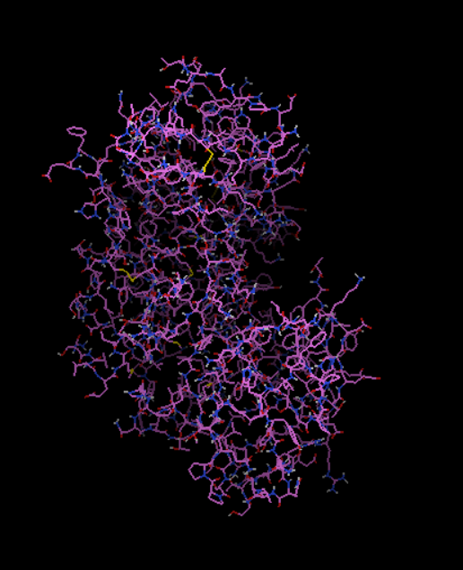

# Structure-Based Virtual Screening of Flavonoid Compounds Against BACE-1


## 📌 Project Overview

This repository presents an *in silico* structure-based drug discovery workflow employed to identify potential inhibitors of **β-site amyloid precursor protein cleaving enzyme-1 (BACE-1)** from a flavonoid compound library.

The study integrates targeted molecular docking using **AutoDock Vina** with post-docking drug-likeness screening based on **Lipinski’s Rule of Five**, enabling prioritization of compounds with favorable binding affinity and physicochemical properties.

The overall computational strategy follows a workflow commonly reported in flavonoid-based virtual screening studies, where docking results are combined with Lipinski filtering to shortlist lead-like molecules prior to further *in silico* or experimental validation.

---

## 🧬 Target Protein



*Figure 1: Overall three-dimensional structure of BACE-1 (PDB ID: 2ZJIN).The central cavity represents the substrate-binding cleft.*

* **Protein:** β-site amyloid precursor protein cleaving enzyme-1 (BACE-1)
* **PDB ID:** `2ZJIN`
* **Biological Relevance:** Key enzyme involved in amyloid-β peptide generation in Alzheimer’s disease.
* **Catalytic Residues:** **Asp32** and **Asp228** (aspartyl protease dyad).

---

## 🧪 Ligand Library

* **Library Size:** 1000 compounds
* **Compound Class:** Flavonoids
* **Initial Representation:** SMILES
* **Docking Format:** PDBQT

---

## ⚙️ Computational Workflow

### 1️⃣ Protein Preparation
* Protein structure retrieved from the Protein Data Bank (PDB).
* Removal of crystallographic water molecules.
* Addition of polar hydrogens.
* Assignment of Gasteiger charges.
* Protein saved in PDBQT format using **AutoDock Tools**.

### 2️⃣ Active-Site Identification and Grid Validation
Docking was performed using a targeted (active-site) approach. The search space was defined to encompass the catalytic dyad (**Asp32** and **Asp228**), which is essential for BACE-1 proteolytic activity.

**Visual Verification:**
The grid box center and dimensions were visually inspected in PyMOL relative to the crystallographic ligand and catalytic residues.


*Figure 2: Visualization of the docking grid box (Red) centered on the BACE-1 active site. The catalytic aspartyl residues (Asp32, Asp228) are highlighted in stick representation, confirming their inclusion within the search space.*

**Grid Parameters:**
* **Center:** `x=74.44`, `y=32.979`, `z=28.979`
* **Size:** `30 x 30 x 30 Å`

> **Validation Outcome:** The grid box successfully covers the substrate-binding cleft without being excessively large, reducing the false-positive rate from non-specific surface binding.

### 3️⃣ Ligand Preparation
* SMILES converted to three-dimensional structures.
* Energy minimization performed.
* Partial charges assigned.
* Ligands saved individually in PDBQT format.
* *Ligand preparation was performed consistently across the entire library.*

### 4️⃣ Molecular Docking
* **Software:** AutoDock Vina
* **Method:** Docking performed individually for each ligand.
* **Ranking:** Poses ranked based on binding affinity; the lowest binding energy pose was retained.

**AutoDock Vina Configuration (`config.txt`):**
```bash
receptor = protein/BACE1_prepared.pdbqt

center_x = 74.44
center_y = 32.979
center_z = 28.979

size_x = 30
size_y = 30
size_z = 30

exhaustiveness = 8
num_modes = 9
log = vina_log.txt

```
### 5️⃣ Drug-Likeness & Toxicity Screening

A multi-stage screening pipeline was implemented to evaluate the drug-likeness and safety profile of the docked flavonoid compounds.


### 🔹 Step A: Physicochemical Descriptors (Open Babel)

Key molecular descriptors required for drug-likeness evaluation were calculated using **Open Babel**:

- **Molecular Weight (MW)**
- **LogP** (Octanol/Water Partition Coefficient)
- **Hydrogen Bond Donors (HBD)**
- **Hydrogen Bond Acceptors (HBA)**

---

### 🔹 Step B: Toxicity & Drug Scores (OSIRIS Property Explorer)

**OSIRIS Property Explorer** was used to predict toxicity risks and overall drug potential:

- **Drug-Likeness Score**
- **Molar Refractivity (MR)**
- **Toxicity Risks (TR):**
  - Mutagenicity  
  - Tumorigenicity  
  - Irritancy  
- **Reproductive Effects (RE)**

---

### 🔹 Step C: Data Integration & Filtering (Microsoft Excel)

- Docking scores, Lipinski descriptors, and OSIRIS predictions were merged into a master dataset  
- Logical filters were applied using **Excel formulas** to automate compound classification  

---

### 🧪 Lipinski’s Rule of Five Criteria

A compound was considered **PASS** if it violated **no more than one** of the following conditions:

1. \( MW <=500 \)  
2. \( LogP <=5 \)  
3. \( HBD <=5 \)  
4. \( HBA <=10 \)  

---

### 🏆 Final Shortlisting Criteria

Compounds were prioritized based on the intersection of:

- Strong docking affinity  
- Lipinski **PASS** status  
- Positive OSIRIS drug-likeness score  
- Absence of high-risk toxicity alerts  

---

### 📊 Results Summary

- ✅ **Docking:** Several flavonoids demonstrated favorable binding affinities within the BACE-1 active site  
- ⚠️ **Lipinski Analysis:** Violations were primarily associated with high molecular weight or excessive hydrogen bonding capacity  
- 🚫 **Toxicity Screening:** OSIRIS predictions eliminated high-affinity compounds with potential toxicity risks  
- 🏆 **Outcome:** A refined subset of flavonoids was shortlisted as potential lead candidates for further investigation  

---
### 🏆 Top Candidate Compounds
|Compound Name                                                                                                                                                                                                                |MR      |TR     |IE     |RE     |Drug Score|affinity|SMILES                                                                                                                           |MW     |LogP   |HBD|HBA1|PASS/FAIL |MW     |logP   |HBD|HBA1|
|-----------------------------------------------------------------------------------------------------------------------------------------------------------------------------------------------------------------------------|--------|-------|-------|-------|----------|--------|---------------------------------------------------------------------------------------------------------------------------------|-------|-------|---|----|----------|-------|-------|---|----|
|Apiferol, Apiforol, Leucoapigeninidin                                                                                                                                                                                        |low     | low   |low    |low    |0.87      |-8.9    |Oc(c3)ccc(c3)C(C1)Oc(c2)c(c(O)cc(O)2)C(O)1                                                                                       |274.269|2.3606 |4  |5   |Pass      |274.269|2.3606 |4  |5   |
|6-Hydroxykaempferol 5,6-dimethyl ether                                                                                                                                                                                       |low     |low    |low    |low    |0.73      |-8.9    |COc(c(O)3)c(OC)c(C(=O)1)c(c3)OC(c(c2)ccc(O)c2)=C(O)1                                                                             |330.289|2.594  |3  |6   |Pass      |330.289|2.594  |3  |6   |
|6-Methoxykaempferol 3-rhamnoside                                                                                                                                                                                             |low     |low    |low    |none   |0.73      |-9.1    |OC(C1OC(=C(c(c4)ccc(c4)O)3)C(=O)c(c(O3)2)c(c(OC)c(c2)O)O)C(C(O)C(C)O1)O                                                          |462.403|0.7917 |6  |10  |Pass      |462.403|0.7917 |6  |10  |
|7,8-Dimethoxy-3',4'-methylenedioxyisoflavone                                                                                                                                                                                 |low     |low    |low    |low    |0.7       |-8.8    |c(c41)(OCO4)ccc(C(C2=O)=COc(c3OC)c2ccc3OC)c1                                                                                     |326.3  |3.2059 |0  |5   |Pass      |326.3  |3.2059 |0  |5   |
|7,8,2'-Trimethoxy-4',5'-methylenedioxyisoflavone                                                                                                                                                                             |Low     |Low    |low    |none   |0.68      |-10.8   |c(c34)c(c(OC)cc3OCO4)C(C1=O)=COc(c2OC)c1ccc2OC                                                                                   |356.326|3.2145 |0  |6   |Pass      |356.326|3.2145 |0  |6   |
|Antiarone K                                                                                                                                                                                                                  |low     |low    |low    |none   |0.63      |-9.2    |C(C)(C)(O)[C@H](C1)[C@@](CC(=O)c(c3O)c(cc(c3)O)O)([H])c(c2)c(c(OC)c(c2)OC)1                                                      |402.438|3.1204 |4  |8   |Pass      |402.438|3.1204 |4  |8   |
|Acacetin 7-O-alpha-L-rhamnopyranoside                                                                                                                                                                                        |low     |low    |low    |low    |0.62      |-9      |c(c1C(O2)=CC(c(c4O)c(cc(c4)OC(C3O)OC(C(O)C3O)C)2)=O)cc(OC)cc1                                                                    |430.405|1.3805 |4  |8   |Pass      |430.405|1.3805 |4  |8   |
|Betagarin                                                                                                                                                                                                                    |Low     |low    |Low    |none   |0.58      |-9.3    |c(c(C(C4)(Oc(c3)c(C4=O)c(c(c32)OCO2)OC)[H])1)(OC)cccc1                                                                           |328.316|3.139  |0  |7   |Pass      |328.316|3.139  |0  |7   |
|7,4'-Dihydroxy-3'-methoxy-8-methylflavan                                                                                                                                                                                     |low     |low    |low    |low    |0.57      |-8.7    |COc(c(O)3)cc(cc3)[C@H](C1)Oc(c(C)2)c(ccc(O)2)C1                                                                                  |286.322|3.4811 |2  |4   |Pass      |286.322|3.4811 |2  |4   |
|Citflavanone                                                                                                                                                                                                                 |low     |low    |low    |low    |0.56      |-8.8    |C(=O)(C1)c(c(O)3)c(c(C=4)c(OC(C4)(C)C)c3)OC1c(c2)ccc(O)c2                                                                        |338.354|3.9885 |2  |5   |Pass      |338.354|3.9885 |2  |5   |
|6,5'-Dihydroxy-3,7,2',4'-tetramethoxyflavone                                                                                                                                                                                 |Low     |low    |Low    |None   |0.56      |-10.1   |O(c23)C(=C(C(c2cc(O)c(OC)c3)=O)OC)c(c(OC)1)cc(O)c(OC)c1                                                                          |374.341|2.9056 |2  |7   |Pass      |374.341|2.9056 |2  |7   |
|7-Hydroxyflavan                                                                                                                                                                                                              |low     |low    |Low    |none   |0.54      |-9      |Oc(c3)cc(O1)c(c3)CCC([H])1c(c2)cccc2                                                                                             |226.27 |3.4585 |1  |3   |Pass      |226.27 |3.4585 |1  |3   |
|Acacetin 7- (6"-acetylglucoside)                                                                                                                                                                                             |low     |low    |low    |None   |0.52      |-9.2    |Oc(c1)c(C(=O)4)c(OC(=C4)c(c3)ccc(c3)OC)cc1OC(C2O)OC(COC(C)=O)C(C2O)O                                                             |488.441|0.9237 |4  |10  |Pass      |488.441|0.9237 |4  |10  |
|6'-Demethoxypraecansone B                                                                                                                                                                                                    |low     |low    |low    |low    |0.5       |-8.8    |COc(c2C(C=C(O)c(c3)cccc3)=O)c(c(cc2)1)C=CC(C)(C)O1                                                                               |336.381|4.6612 |1  |4   |Pass      |336.381|4.6612 |1  |4   |
|Acacetin 7-apiosyl (1->6) -glucopyranoside, Apigenin 4'-methyl ether 7-apiosyl (1->6) -glucopyranoside, 5-Hydroxy-2- (4-methoxyphenyl) -7- [ (6-O-D-apio-beta-D-furanosyl-beta-D-glucopyranosyl) oxy ] -4H-1-benzopyran-4-one|low     |low    |low    |low    |0.46      |-9      |c(c5OC)cc(cc5)C(=C4)Oc(c1)c(C4=O)c(O)cc1OC(C(O)2)OC(COC(C3O)OCC3(CO)O)C(O)C2O                                                    |578.519|-1.1822|7  |13  |Fail      |578.519|-1.1822|7  |13  |
|Apigenin 5-rhamnosyl- (1->2) - (6"-acetylglucoside)                                                                                                                                                                          |low     |low l  |low    |medium |0.42      |-8.8    |C(O)(C(O)1)C(OC(Oc(c5)c(C3=O)c(cc(O)5)OC(c(c4)ccc(c4)O)=C3)C1OC(C2O)OC(C)C(C2O)O)COC(C)=O                                        |620.555|-0.5275|7  |14  |Fail      |620.555|-0.5275|7  |14  |
|Coccinoside B                                                                                                                                                                                                                |low     |low    |low    |low    |0.42      |-8.8    |c(O)(c1)ccc(c1C(C4)Oc(c3C(=O)4)cc(cc(O)3)OC(O2)C(O)C(O)C(O)C2CO)O                                                                |450.393|-0.3114|7  |11  |Fail      |450.393|-0.3114|7  |11  |
|Acacetin 7- (6"-methylglucuronide)                                                                                                                                                                                           |low     |low    |low    |low    |0.4       |-8.7    |c(c1C(O2)=CC(c(c4O)c(cc(c4)OC(O3)C(O)C(C(O)C3C(OC)=O)O)2)=O)cc(OC)cc1                                                            |474.414|0.5336 |4  |10  |Pass      |474.414|0.5336 |4  |10  |
|6-Hydroxykaempferol 3-methyl ether 6-glucoside                                                                                                                                                                               |low     |low    |Low    |None   |0.4       |-9.2    |O=C(C(OC)=3)c(c(OC3c(c4)ccc(c4)O)1)c(O)c(O[C@H](O2)[C@@H](O)[C@H]([C@H](C(CO)2)O)O)c(c1)O                                        |478.403|-0.2359|7  |11  |Fail      |478.403|-0.2359|7  |11  |
|6-Methoxytricin, 5,7,4'-Trihydroxy-6,3',5'-trimethoxyflavone                                                                                                                                                                 |high    |Medium |Low    |low    |0.38      |-8.8    |c(c1O)(OC)cc(C(O2)=CC(c(c3O)c2cc(c3OC)O)=O)cc1OC                                                                                 |360.315|2.6026 |3  |7   |Pass      |360.315|2.6026 |3  |7   |
|Apigenin 7- (3"-p-coumaroylglucoside)                                                                                                                                                                                        |low     |low    |low    |low    |0.37      |-8.9    |c(O)(c5)ccc(c5)C(O4)=CC(c(c14)c(O)cc(OC(C2O)OC(CO)C(C2OC(=O)C=Cc(c3)ccc(O)c3)O)c1)=O                                             |578.52 |2.0198 |6  |11  |Fail      |578.52 |2.0198 |6  |11  |
|Abyssinone V 4'-methyl ether                                                                                                                                                                                                 |low     |low    |low    |low    |0.35      |-8.9    |C(C2=O)C(c(c3)cc(CC=C(C)C)c(OC)c(CC=C(C)C)3)Oc(c21)cc(O)cc1O                                                                     |422.513|5.8303 |2  |5   |Pass      |422.513|5.8303 |2  |5   |
|6a-Hydroxyinermin, 6a-Hydroxymaackiain                                                                                                                                                                                       |low     |low    |low    |High   |0.33      |-8.7    |Oc(c5)cc(O4)c(c5)C(O1)C(O)(C4)c(c2)c(cc(O3)c(OC3)2)1                                                                             |300.263|1.8346 |2  |6   |Pass      |300.263|1.8346 |2  |6   |
|8-C-Methylquercetagetin 3,6,3'-trimethyl ether                                                                                                                                                                               |high    |Medium |low    |low    |0.33      |-8.7    |c(c3OC)(c(c(O1)c(c3O)C(C(=C1c(c2)cc(OC)c(O)c2)OC)=O)C)O                                                                          |374.341|2.911  |3  |7   |Pass      |374.341|2.911  |3  |7   |
|6-Prenylherbacetin 3,8-dimethyl ether, 5,7,4'-Trihydroxy-3,8-dimethoxy-6-prenylflavone                                                                                                                                       |high    |low    |low    |low    |0.32      |-8.8    |c(c3)(ccc(c3)C(O2)=C(OC)C(=O)c(c21)c(O)c(c(O)c(OC)1)CC=C(C)C)O                                                                   |398.406|4.1027 |3  |6   |Pass      |398.406|4.1027 |3  |6   |
|Bonannione A                                                                                                                                                                                                                 |low     |low    |Low    |none   |0.32      |-9.3    |c(c(O)1)(c(O)c(C2=O)c(OC(c(c3)ccc(c3)O)C2)c1)CC=C(C)CCC=C(C)C                                                                    |408.487|5.7451 |3  |5   |Pass      |408.487|5.7451 |3  |5   |
|6-Methoxykaempferol 7-glucoside                                                                                                                                                                                              |Medium  |low    |low    |none   |0.32      |-9.4    |COc(c3OC(C(O)4)OC(CO)C(C4O)O)c(c(C2=O)c(c3)OC(=C2O)c(c1)ccc(c1)O)O                                                               |478.403|-0.2359|7  |11  |Fail      |478.403|-0.2359|7  |11  |
|Acacetin 7-glucosyl- (1->4) -xyloside, Apigenin 4'-methyl ether 7-glucosyl- (1->4) -xyloside                                                                                                                                 |low     |low    |low    |low    |0.31      |-8.7    |c(c5OC)cc(cc5)C(O4)=CC(c(c41)c(O)cc(OC(C(O)3)OCC(C3O)OC(O2)C(C(C(C2CO)O)O)O)c1)=O                                                |578.519|-1.1838|7  |13  |Fail      |578.519|-1.1838|7  |13  |
|8-Hydroxychrysoeriol 8-glucuronide, 8-Hydroxyluteolin 3'-methyl ether 8-glucuronide                                                                                                                                          |High    |Medium |Low    |None   |0.31      |-11.4   |Oc(c24)cc(c(c(OC(=CC4=O)c(c3)cc(c(c3)O)OC)2)OC(C(O)1)OC(C(O)C1O)C(O)=O)O                                                         |492.386|-0.1436|7  |12  |Fail      |492.386|-0.1436|7  |12  |
|6-Hydroxykaempferol 3,6-diglucoside                                                                                                                                                                                          |low     |low    |low    |low    |0.3       |-8.9    |c(C(=C4O[C@@H](C(O)5)O[C@@H]([C@@H](C(O)5)O)CO)Oc(c3C4=O)cc(O)c(c3O)O[C@H](O2)[C@@H](O)[C@@H](O)[C@@H](O)C2CO)(c1)ccc(c1)O       |626.517|-3.0658|11 |16  |Fail      |626.517|-3.0658|11 |16  |
|7a-O-Methyldeguelol                                                                                                                                                                                                          |low low |low    |low    |HIGH   |0.29      |-9      |c(c2)c(C(C(C3)c(c4)c(cc(OC)c4OC)OC3)=O)c(O)c(c12)C=CC(O1)(C)C                                                                    |396.433|4.3426 |1  |6   |Pass      |396.433|4.3426 |1  |6   |
|8-Hydroxyluteolin 4'-methyl ether 7- (6"'-acetylallosyl) (1->2) (6"-acetylglucoside)                                                                                                                                         |high    |low    |low    |low    |0.28      |-8.8    |C(C2Oc(c5)c(c(c4c(O)5)OC(=CC(=O)4)c(c3)ccc(OC)c3O)O)(C(C(O)C(O2)COC(C)=O)O)OC(O1)C(O)C(O)C(O)C1COC(C)=O                          |724.617|-1.2701|8  |18  |Fail      |724.617|-1.2701|8  |18  |
|6"'-Feruloylsaponarin, Isovitexin 7-O-beta- [ 6"'-O- (E) -p-feruloyl ] glucoside                                                                                                                                             |low     |low    |low    |low    |0.26      |-8.7    |COc(c(O)6)cc(cc6)C=CC(OCC(C(O)1)OC(Oc(c(C(C(O)5)OC(C(C(O)5)O)CO)2)cc(O3)c(C(C=C3c(c4)ccc(O)c4)=O)c(O)2)C(O)C(O)1)=O              |770.687|-0.4567|10 |17  |Fail      |770.687|-0.4567|10 |17  |
|8-Methoxycoumestrol, 3'-Methoxycoumestrol                                                                                                                                                                                    |low     |low    |low    |High   |0.25      |-8.7    |COc(c(O)4)cc(c(c4)3)c(C(=O)1)c(o3)c(c2)c(cc(O)c2)O1                                                                              |298.247|3.1122 |2  |4   |Pass      |298.247|3.1122 |2  |4   |
|Amorilin                                                                                                                                                                                                                     |low     | low   |low    |low    |0.23      |-8.7    |C(Cc(c1O)c(c(c(O2)c1C(=O)CC2c(c3)cc(CC=C(C)C)c(c3)O)CC=C(C)C)O)=C(C)C                                                            |476.604|7.036  |3  |5   |Pass      |476.604|7.036  |3  |5   |
|Ambocin, Genistein 7-O-apiosyl- (1->6) -glucoside                                                                                                                                                                            |low     |HIGH   |LOW    |high   |0.22      |-8.7    |C(C1OCC(O2)C(O)C(C(O)C2Oc(c5)cc(O)c(c53)C(C(c(c4)ccc(c4)O)=CO3)=O)O)(C(CO)(CO1)O)O                                               |564.492|-1.4852|8  |13  |Fail      |564.492|-1.4852|8  |13  |
|Abyssinone V                                                                                                                                                                                                                 |low     |low    |Low    |none   |0.22      |-9      |C(=O)(C2)c(c(OC(c(c3)cc(CC=C(C)C)c(O)c3CC=C(C)C)([H])2)1)c(O)cc(c1)O                                                             |408.487|5.5273 |3  |6   |Pass      |408.487|5.5273 |3  |6   |
|Abyssinone III                                                                                                                                                                                                               |low     |low    |low    |none   |0.22      |-9.1    |CC(C)=CCc(c2)c(O1)c(cc2C(C4)Oc(c(C4=O)3)cc(O)cc3)C=CC1(C)C                                                                       |390.472|5.7916 |1  |4   |Pass      |390.472|5.7916 |1  |4   |
|Brickellin                                                                                                                                                                                                                   |high    |high   |low    |None   |0.22      |-9.1    |C(O2)(=C(C(c(c3O)c2cc(c3OC)OC)=O)OC)c(c1)c(cc(OC)c(OC)1)O                                                                        |404.367|2.9142 |2  |8   |Pass      |404.367|2.9142 |2  |8   |
|Adunctin A                                                                                                                                                                                                                   |low     |low    |low    |low    |0.21      |-9      |CC(C)[C@@](Oc(c3)c(c(cc(OC)3)O)C(=O)CCc(c2)cccc2)(C1)C=CC(C1)C                                                                   |408.53 |5.976  |1  |4   |Pass      |408.53 |5.976  |1  |4   |
|Abyssinone IV                                                                                                                                                                                                                |low     |low    |low    |low    |0.2       |-8.8    |Oc(c1)cc(O2)c(C(=O)CC2c(c3)cc(c(O)c(CC=C(C)C)3)CC=C(C)C)c1                                                                       |392.487|5.8217 |2  |4   |Pass      |392.487|5.8217 |2  |4   |
|Cachimoside, Kachimoside, Vitexin 6"-O-xyloside                                                                                                                                                                              |High    |low    |low    |none   |0.2       |-9.3    |C(OCC(O2)C(C(O)C(C2c(c35)c(cc(c3C(=O)C=C(O5)c(c4)ccc(O)c4)O)O)O)O)(O1)C(O)C(C(O)C1)O                                             |564.492|-1.445 |9  |13  |Fail      |564.492|-1.445 |9  |13  |
|Apigenin 7- (2",6"-di-p-coumarylglucoside)                                                                                                                                                                                   |low     |low    |low    |low    |0.18      |-9      |C(c(c6)ccc(c6)O)=CC(=O)O[C@@H]([C@H]5O)[C@@H](OC([C@@H]5O)COC(=O)C=Cc(c4)ccc(c4)O)Oc(c3)cc(c(c(O)3)1)OC(c(c2)ccc(c2)O)=CC(=O)1   |724.663|3.9897 |6  |13  |Fail      |724.663|3.9897 |6  |13  |
|8-Hydroxyluteolin 3'-methyl ether 7-allosyl- (1->2) -glucoside                                                                                                                                                               |High    |low    |low    |low    |0.17      |-8.7    |c(C(=C2)Oc(c3O)c(c(cc3O[C@@H]([C@@H](O[C@@H]([C@H]5O)OC([C@@H]([C@@H]5O)O)CO)4)OC(CO)[C@@H]([C@H](O)4)O)O)C2=O)(c1)ccc(c(OC)1)O  |640.543|-2.4117|10 |16  |Fail      |640.543|-2.4117|10 |16  |
|Chrysin 6-C-glucoside-8-C-alpha-L-arabinopyranoside                                                                                                                                                                          |High    |low    |low    |none   |0.16      |-9.1    |C(C(C1O)OC(c(c4O)c(O)c(c(c4C(O5)C(O)C(O)C(O)C5)2)C(=O)C=C(c(c3)cccc3)O2)C(C1O)O)O                                                |548.493|-1.4599|9  |12  |Fail      |548.493|-1.4599|9  |12  |
|7,8,3',4',5'-Pentamethoxy-6",6"-dimethylpyrano [ 2",3":5,6 ] flavone                                                                                                                                                         |HIGH    |high   |low    |high   |0.11      |-8.9    |c(C(=O)1)(c34)c(c(OC)c(c(C=CC(O4)(C)C)3)OC)OC(c(c2)cc(OC)c(OC)c2OC)=C1                                                           |454.469|4.6872 |0  |7   |Pass      |454.469|4.6872 |0  |7   |
|Angustone A                                                                                                                                                                                                                  |low     |high   |high   |medium |0.11      |-9.1    |c(c13)c(c(c(c(C(C(=CO3)c(c2)c(c(c(c2)O)CC=C(C)C)O)=O)1)O)CC=C(C)C)O                                                              |422.47 |5.2998 |4  |5   |Pass      |422.47 |5.2998 |4  |5   |
|Abyssinone VI                                                                                                                                                                                                                |high    |low    |medium |low    |0.1       |-8.8    |c(c1C=CC(=O)c(c2O)ccc(c2)O)c(CC=C(C)C)c(O)c(c1)CC=C(C)C                                                                          |392.487|5.7169 |3  |4   |Pass      |392.487|5.7169 |3  |4   |
|Apigenin 7-neohesperidoside-4'-sophoroside                                                                                                                                                                                   |high    |low    |low    |high   |0.09      |-9      |C(c(c7)ccc(c7)OC(O6)C(C(C(O)C6CO)O)OC(O5)C(O)C(C(O)C5CO)O)(O1)=CC(=O)c(c(O)2)c(cc(OC(C3OC(C(O)4)OC(C)C(O)C(O)4)OC(C(C3O)O)CO)c2)1|902.8  |-5.801 |14 |23  |Fail      |902.8  |-5.801 |14 |23  |

---

### 🛠️ Software Used

| Software | Purpose |
| :--- | :--- |
| **AutoDock Vina** | Molecular docking |
| **AutoDock Tools** | Protein & ligand preparation |
| **Open Babel v3.1.1** | Physicochemical descriptor calculation |
| **OSIRIS Property Explorer** | Toxicity & drug-likeness prediction |
| **PyMOL** | Structural visualization |
| **Microsoft Excel** | Data integration & logical filtering |

---

### 📜 License

This project is intended **solely for academic and research purposes**.
